# KOSA_Project

# RabbitMQ 쉽게 배우기 (비유 + 그림 + 실습)

> 이 문서는 어려운 단어를 최대한 풀어쓰고, 일상 속 비유와 다이어그램으로 RabbitMQ를 설명합니다.
> 끝부분에는 **Docker + Python(pika)** 실습과 **웹 관리 UI** 실습을 함께 제공합니다.

---

## 0. 시작하기 전에: RabbitMQ를 한 줄로

> **"RabbitMQ는 회사의 우편실(메일룸)이다."**

직원 A가 직원 B에게 서류를 직접 들고 가는 게 아니라, **우편실에 맡겨 두면 우편실이 알아서 분류하고 전달**해 줍니다. 직원 B가 잠시 자리를 비워도 서류는 우편함에 안전하게 보관됩니다.

이 한 문장만 머릿속에 두고 출발해 봅시다.

---

## 1. 왜 메시지 큐가 필요한가? (전화 vs 우편)

### 1.1 직접 호출 = 전화 통화


- B가 통화 중이면 A는 **계속 기다려야** 합니다.
- B가 아프면(장애) A도 **일을 못 합니다**.
- B 전화번호가 바뀌면 A도 **수정**해야 합니다.

### 1.2 메시지 큐 = 우편 보내기


- A는 우편을 **맡기자마자** 자기 일을 계속합니다.
- B가 잠깐 자리를 비워도 우편함에 **쌓여 있습니다**.
- B가 늘어나면(여러 명) **나눠서** 처리할 수 있습니다.
- A는 B가 누구인지, 어디 있는지 **몰라도 됩니다**.

> 🐰 **핵심:** "지금 당장 답이 필요 없는 일"은 큐에 맡기면 시스템이 훨씬 튼튼해집니다.

---

## 2. RabbitMQ의 큰 그림

### 2.1 전체 구성도

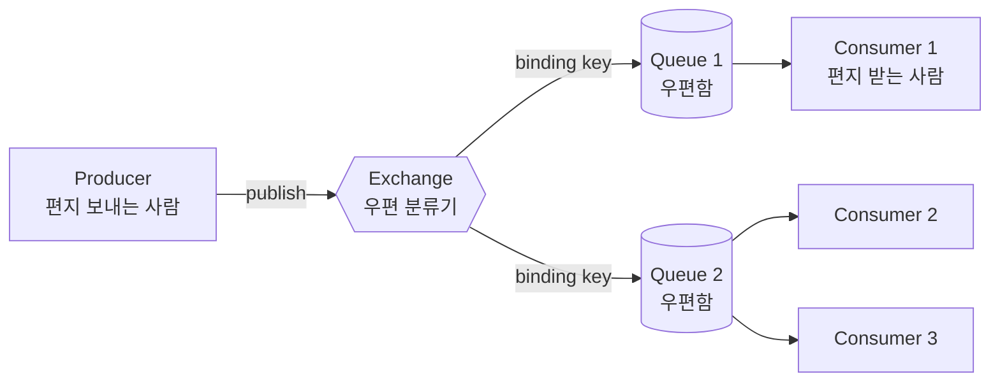

- **Producer(생산자)** = 편지 쓰는 사람
- **Exchange(교환기)** = 우편 분류기 (어느 우편함에 넣을지 결정)
- **Binding(바인딩)** = "어떤 라벨이 붙은 편지를 어느 우편함으로 보낼지" 적어둔 규칙
- **Queue(큐)** = 우편함
- **Consumer(소비자)** = 편지 꺼내 읽는 사람

> 🚩 **꼭 기억할 것:** Producer는 Queue에 **직접** 넣지 않습니다. 항상 Exchange를 거칩니다.
> (편지를 우편함에 직접 넣지 않고 분류기에 맡기는 것과 같습니다.)

### 2.2 큰 단위로 묶어보기 (브로커, vhost)

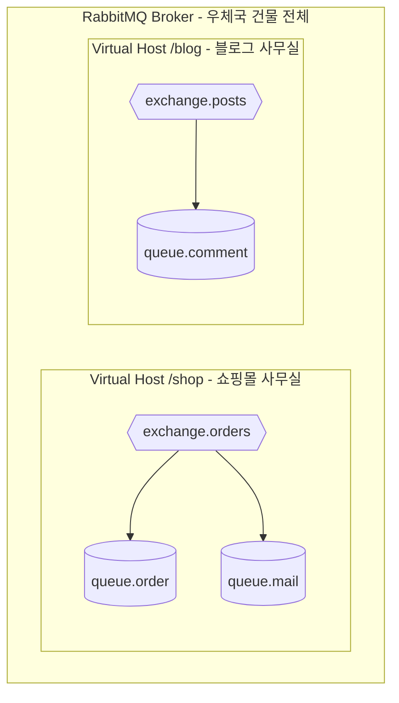

- **Broker** = 우체국 건물 전체 (RabbitMQ 서버)
- **Virtual Host (vhost)** = 건물 안의 **사무실**. 사무실끼리는 서로 못 보게 격리됨.
- 권한도 사무실 단위로 줄 수 있어요. ("쇼핑몰 사무실만 들어와" 같은 식)

### 2.3 Connection vs Channel (전화선과 통화)

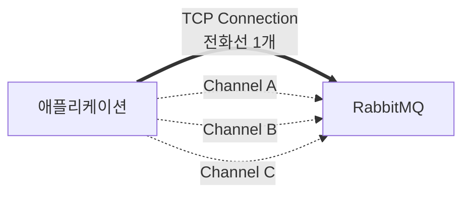

- **Connection** = 사무실에 깔린 **전화선**. 비싸고 연결에 시간이 걸림.
- **Channel** = 그 전화선으로 거는 **개별 통화**. 가볍고 여러 개를 동시에 가능.

> 💡 **실수 포인트:** 메시지 보낼 때마다 Connection을 새로 만들면 매우 느려집니다.
> Connection은 한 번 만들어서 **계속 재사용**, Channel은 작업/스레드별로 만드세요.

---

## 3. Exchange 4종 — "분류기"의 종류

분류기(Exchange)가 편지를 어느 우편함으로 보낼지 결정하는 방식이 4가지입니다. 비유와 함께 봅시다.

### 3.1 Direct — "정확한 이름표"

> 🏷️ "이름표가 정확히 일치하는 우편함에만 넣기"

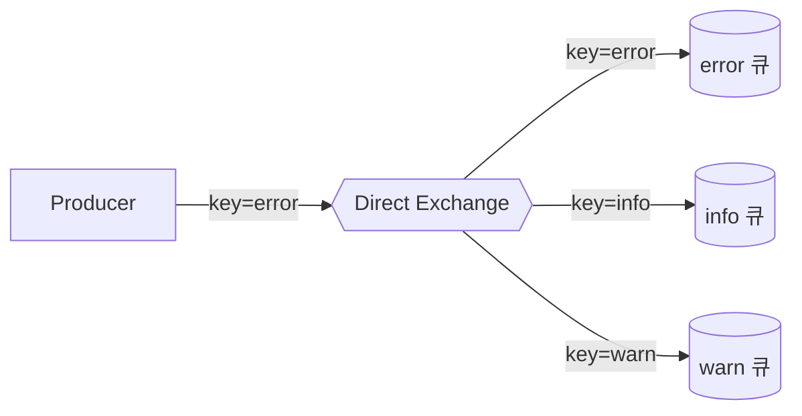

- 라우팅 키가 `"error"`면 error 큐로만 들어갑니다.
- 가장 단순하고 가장 많이 쓰입니다.

### 3.2 Fanout — "전체 회람"

> 📢 "라벨 따위 무시! 모든 우편함에 똑같이 복사해서 넣기"

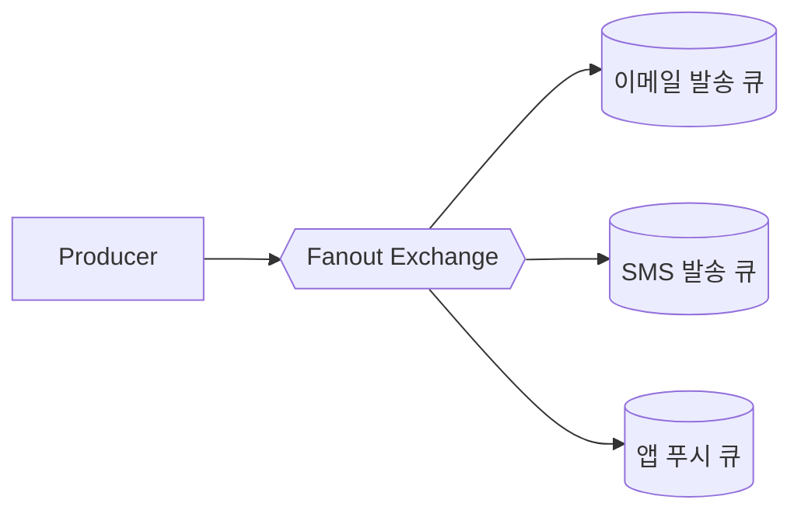

- 공지사항, 캐시 무효화 같은 **브로드캐스트**에 사용.

### 3.3 Topic — "패턴 매칭"

> 🔍 "라벨이 `order.*.urgent` 같은 패턴과 맞으면 넣기"

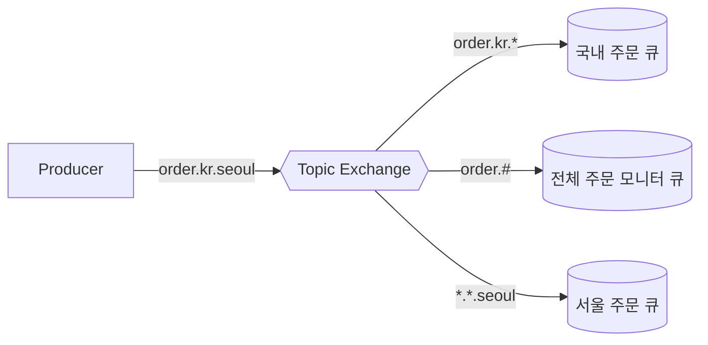

- `*` = 단어 1개와 매치
- `#` = 단어 0개 이상과 매치
- "지역별/카테고리별/등급별" 처럼 **다차원 분류**가 필요할 때 좋습니다.

### 3.4 Headers — "조건 메모로 매칭"

> 📋 "라벨 대신 첨부된 메모(헤더)를 보고 분류"

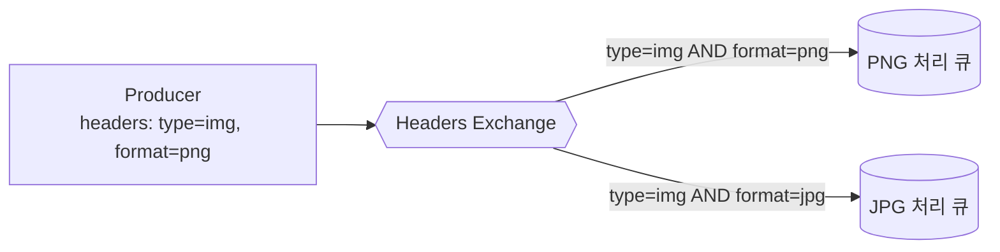

- 라우팅 키 대신 헤더 key-value로 매칭.
- 유연하지만 직관성이 떨어져 자주 쓰이진 않습니다.

### 3.5 한눈에 비교

| 종류 | 비유 | 언제 쓰나 |
|---|---|---|
| Direct | 정확한 이름표 | 키별로 다른 큐에 넣고 싶을 때 |
| Fanout | 단체 회람 | 모두에게 동시에 알리고 싶을 때 |
| Topic | 패턴 매칭 | 다차원 분류가 필요할 때 |
| Headers | 메모 매칭 | 키-값 조건이 복잡할 때 |

---

## 4. 메시지가 흘러가는 한 사이클

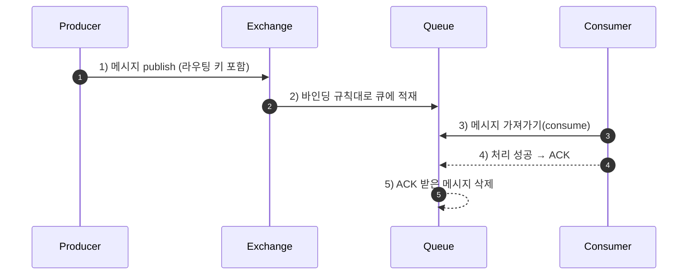

> 🍞 **비유:** 빵집(Producer)이 빵을 만들어 진열대(Exchange) 직원에게 주면, 직원은 종류별 매대(Queue)에 올려놓고, 손님(Consumer)이 빵을 가져간 뒤 "잘 받았어요(ACK)"라고 말하면 매대에서 빵이 사라집니다.

만약 손님이 "이거 못 먹겠어요(NACK)"라고 거부하면? 다시 매대에 올리거나, **불량 상자(DLX)** 로 보낼 수 있습니다.

---

## 5. 6가지 기본 메시징 패턴 (그림 위주)

### 5.1 Simple Queue (1:1)
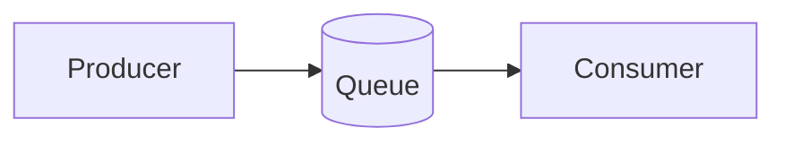
가장 단순. "한 사람이 보내고 한 사람이 받는다."

### 5.2 Work Queue (작업 분배)
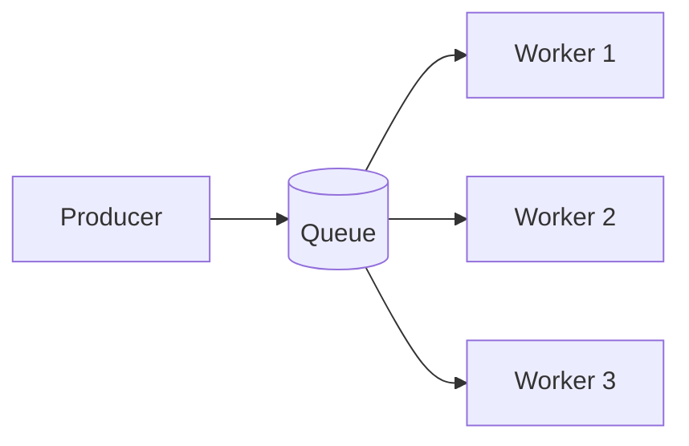
무거운 일을 여러 명이 나눠 처리. 메시지는 **번갈아 가며(round-robin)** 분배됩니다.

> 🍕 **비유:** 피자 주문이 들어올 때 주방에 요리사 3명이 번갈아 받아서 만든다.

### 5.3 Publish/Subscribe (방송)
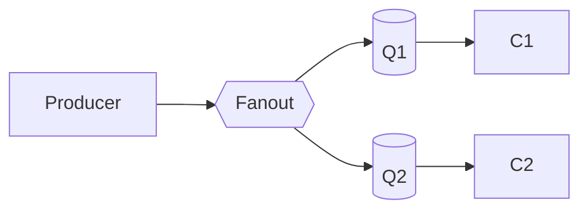
**모두에게** 같은 메시지가 복사돼 갑니다.

### 5.4 Routing (라우팅)
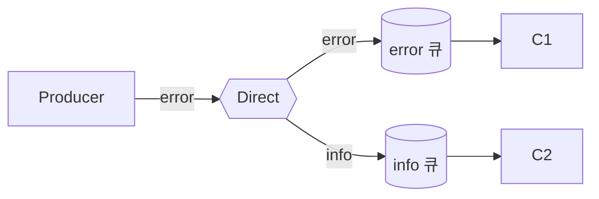
키별로 다른 큐로 분배.

### 5.5 Topics (주제별)
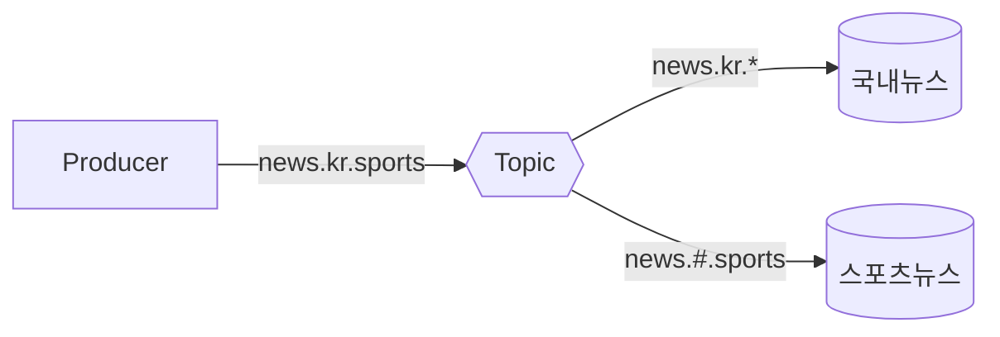
패턴 매칭으로 더 정교한 라우팅.

### 5.6 RPC (요청-응답)
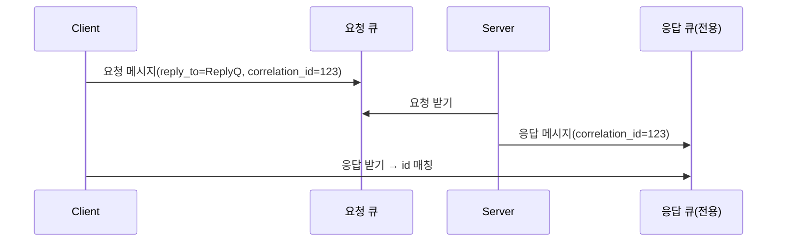
큐를 이용한 비동기 RPC. **correlation_id**로 요청-응답을 짝지어 줍니다.

---

## 6. 메시지를 잃어버리지 않으려면? (신뢰성)

### 6.1 메시지가 사라질 수 있는 4가지 위험 지점

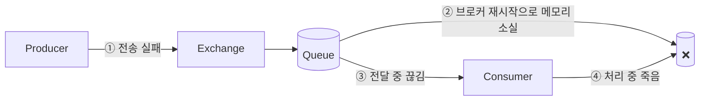

각 지점을 막는 4가지 보호 장치가 있습니다.

### 6.2 ① Publisher Confirm — "보내고 영수증 받기"

> 📮 비유: 등기 우편. "잘 받았어요" 영수증이 와야 안심.

Producer가 confirm 모드를 켜면 브로커가 "받았다/못 받았다"를 알려줍니다. 실패하면 다시 보냅니다.

### 6.3 ② Durable Queue + Persistent Message — "디스크에 저장"

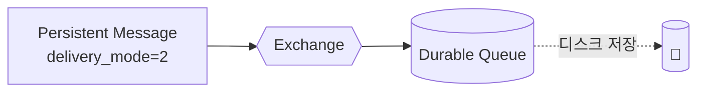

**둘 다** 켜야 재시작 후에도 메시지가 살아남습니다. 하나만 켜면 의미가 없습니다.

### 6.4 ③ Consumer ACK — "다 먹은 다음에 치우기"

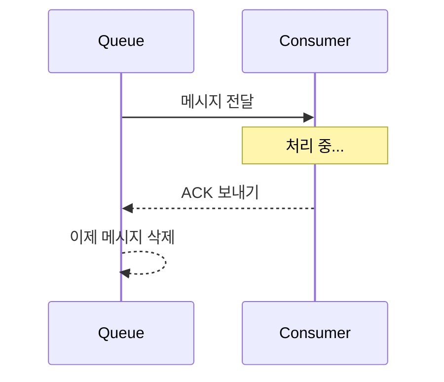

만약 Consumer가 ACK 보내기 전에 죽으면? **자동으로 다른 Consumer에게 재전달**됩니다.

> 🍽️ **비유:** 손님이 음식을 다 먹고 "잘 먹었습니다" 해야 식당에서 그릇을 치움. 손님이 중간에 쓰러지면 다른 직원이 처리.

### 6.5 ④ Dead Letter Exchange (DLX) — "불량품 상자"

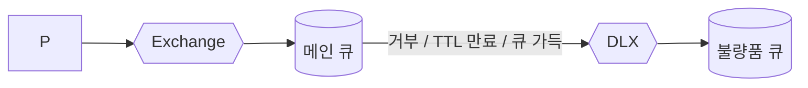

처리 실패한 메시지를 별도 큐에 모아 분석하거나 재시도할 수 있습니다.

> 📦 **비유:** 반품된 택배는 일반 창고가 아니라 **반품 전용 창고**로 보내서 따로 검수.

### 6.6 멱등성 — "두 번 받아도 괜찮게"

RabbitMQ는 기본적으로 **"최소 한 번"** 전달합니다. 즉 **두 번 이상 받을 수도** 있습니다.
- 같은 메시지가 와도 결과가 같도록 만들어야 합니다(예: message_id로 중복 체크).
- 결제처럼 두 번 처리되면 큰일나는 작업은 반드시 멱등하게 설계!

---

## 7. 성능과 운영 한눈에

### 7.1 Prefetch (한 번에 몇 개 가져갈까?)

```mermaid
flowchart LR
    Q[(Queue: 100개 메시지)]
    Q -. prefetch=1 .-> C1[Consumer 한 개씩 받음<br/>안전하지만 느림]
    Q -. prefetch=50 .-> C2[Consumer 한꺼번에 50개<br/>빠르지만 쏠림 위험]
```

너무 작으면 느리고, 너무 크면 한 명에게 일이 몰립니다. 보통 수십 단위로 시작해 튜닝합니다.

### 7.2 Lazy Queue / Memory Alarm
- **Lazy Queue**: 가능한 한 디스크에 저장 → 메모리 절약 (긴 큐에 유리)
- **Memory Alarm**: 메모리 부족 시 브로커가 Producer를 잠시 막아 자기를 보호

### 7.3 클러스터링과 HA

```mermaid
flowchart TB
    subgraph Cluster[RabbitMQ Cluster]
        N1[Node 1<br/>리더] <--> N2[Node 2<br/>팔로워]
        N2 <--> N3[Node 3<br/>팔로워]
        N1 <--> N3
    end
    P[Producer] --> Cluster
    Cluster --> C[Consumer]
```

- **Quorum Queue**: Raft 합의 알고리즘 기반의 **복제 큐** (현재 권장 방식)
- 노드 한 개가 죽어도 나머지가 처리 계속
- 홀수 개(3, 5)로 구성해 **과반수 유지**

> ☂️ **비유:** 우체국 지점이 3개라서 한 지점이 정전돼도 나머지에서 우편을 처리.

---

## 8. 실습 1 — Docker로 RabbitMQ 띄우기 + 관리 UI 둘러보기 (코드 없이)

### 8.1 Docker로 5분 만에 띄우기

터미널에서 한 줄만 실행하면 됩니다.

```bash
docker run -d --name rabbit \
  -p 5672:5672 \
  -p 15672:15672 \
  rabbitmq:3-management
```

설명:
- `5672`: 애플리케이션이 메시지를 주고받는 포트(AMQP)
- `15672`: 웹 관리 UI 포트
- `:3-management`: 관리 UI가 포함된 이미지

### 8.2 관리 UI 접속
브라우저에서 http://localhost:15672 접속.
- 아이디: `guest`
- 비밀번호: `guest`

### 8.3 UI 둘러보기 (그림으로 이해)

```mermaid
flowchart TB
    subgraph UI[Management UI 메뉴]
        OV[Overview<br/>전체 상태]
        CN[Connections<br/>접속 중인 클라이언트]
        CH[Channels<br/>채널 목록]
        EX[Exchanges<br/>분류기 목록]
        QU[Queues and Streams<br/>우편함 목록]
        AD[Admin<br/>사용자/vhost 관리]
    end
```

- **Overview**: 전체 메시지 흐름 그래프
- **Exchanges**: 새로운 분류기를 만들 수 있음
- **Queues**: 큐를 만들거나 메시지 직접 넣어보기 가능

### 8.4 UI에서 손으로 실습해 보기

다음 절차를 따라 해 보세요. **코드 한 줄 없이** 메시지 흐름을 이해할 수 있습니다.

**[실습 A] 큐를 직접 만들고 메시지 넣어보기**

1. 좌측 상단 `Queues and Streams` 탭 클릭
2. 하단 `Add a new queue` 펼치기
3. `Name`에 `hello-queue` 입력 → **Add queue** 클릭
4. 방금 만든 `hello-queue` 클릭 → 하단 `Publish message` 펼치기
5. `Payload`에 `안녕 RabbitMQ!` 입력 → **Publish message** 클릭
6. `Get messages` 펼치기 → **Get Message(s)** 클릭 → 방금 넣은 메시지가 보임 ✅

> 🎯 **포인트:** 위 실습은 사실 **Default Exchange** + 큐 이름과 동일한 라우팅 키를 자동 사용한 것입니다. "Producer는 Exchange를 거친다"는 원칙은 그대로 지켜진 것!

**[실습 B] Direct Exchange로 라우팅 체험**

```mermaid
flowchart LR
    UI[Management UI] -->|key=error| EX{{logs.direct}}
    EX -- key=error --> QE[(queue.error)]
    EX -- key=info --> QI[(queue.info)]
```

1. `Exchanges` 탭 → `Add a new exchange` → Name=`logs.direct`, Type=`direct` → Add
2. `Queues` 탭에서 `queue.error`, `queue.info` 두 개 만들기
3. `Exchanges` → `logs.direct` 클릭 → `Bindings` 섹션에서:
   - To queue: `queue.error`, Routing key: `error` → Bind
   - To queue: `queue.info`, Routing key: `info` → Bind
4. 같은 화면 `Publish message`에서:
   - Routing key: `error`, Payload: `에러 발생!` → Publish
5. `queue.error`에 메시지가 1개 들어가 있음 ✅, `queue.info`는 비어있음
6. 이번엔 Routing key를 `info`로 publish → `queue.info`로만 들어감 ✅

축하합니다! 라우팅이 어떻게 동작하는지 **직접 본 것**입니다.

---

## 9. 실습 2 — Docker + Python(pika)로 코드 실습

### 9.1 준비물

RabbitMQ는 8.1처럼 띄워두고, 별도 터미널에서:

```bash
pip install pika
```

> 💡 pika는 RabbitMQ용 가장 유명한 파이썬 클라이언트입니다.

### 9.2 [실습 1] Hello World — 가장 단순한 송수신

```mermaid
flowchart LR
    Send[send.py<br/>Producer] --> Q[(hello)] --> Recv[recv.py<br/>Consumer]
```

**`send.py` — 보내는 쪽**
```python
import pika

# 1) 우체국(브로커)과 전화선(Connection) 연결
connection = pika.BlockingConnection(
    pika.ConnectionParameters('localhost')
)
channel = connection.channel()  # 통화(Channel) 시작

# 2) 우편함(큐) 준비 — 없으면 만들고 있으면 그냥 사용
channel.queue_declare(queue='hello')

# 3) 편지 보내기 (Default Exchange, routing_key=큐 이름)
channel.basic_publish(
    exchange='',
    routing_key='hello',
    body='Hello RabbitMQ!'
)
print("[x] 보냈어요: Hello RabbitMQ!")

connection.close()  # 전화선 끊기
```

**`recv.py` — 받는 쪽**
```python
import pika

connection = pika.BlockingConnection(
    pika.ConnectionParameters('localhost')
)
channel = connection.channel()
channel.queue_declare(queue='hello')

# 메시지를 받을 때 호출될 함수
def callback(ch, method, properties, body):
    print(f"[v] 받았어요: {body.decode()}")

# hello 큐를 구독 (auto_ack=True: 받자마자 자동 확인)
channel.basic_consume(
    queue='hello',
    on_message_callback=callback,
    auto_ack=True
)

print("[*] 메시지 대기 중. 종료하려면 CTRL+C")
channel.start_consuming()
```

**실행 순서**
1. 한 터미널에서 `python recv.py` (대기 상태)
2. 다른 터미널에서 `python send.py` 여러 번 실행
3. recv 터미널에 메시지가 출력됨 ✅

> 🐰 **이해 포인트:** `exchange=''`은 "Default Exchange를 쓰겠다"는 뜻이고, 이 분류기는 라우팅 키와 같은 이름의 큐로 자동 보내줍니다.

### 9.3 [실습 2] Work Queue — 일을 여러 워커가 나눠 처리

```mermaid
flowchart LR
    NT[new_task.py] --> Q[(task_queue)]
    Q --> W1[worker.py #1]
    Q --> W2[worker.py #2]
    Q --> W3[worker.py #3]
```

**`new_task.py` — 작업 보내기**
```python
import pika, sys

connection = pika.BlockingConnection(pika.ConnectionParameters('localhost'))
channel = connection.channel()

# durable=True: 브로커 재시작에도 큐 유지
channel.queue_declare(queue='task_queue', durable=True)

message = ' '.join(sys.argv[1:]) or "Hello..."
channel.basic_publish(
    exchange='',
    routing_key='task_queue',
    body=message,
    properties=pika.BasicProperties(
        delivery_mode=2,  # persistent: 메시지를 디스크에 저장
    )
)
print(f"[x] 작업 등록: {message}")
connection.close()
```

**`worker.py` — 일하는 사람**
```python
import pika, time

connection = pika.BlockingConnection(pika.ConnectionParameters('localhost'))
channel = connection.channel()
channel.queue_declare(queue='task_queue', durable=True)

# 한 번에 1개씩만 가져오기 (공정한 분배)
channel.basic_qos(prefetch_count=1)

def callback(ch, method, properties, body):
    print(f"[v] 받음: {body.decode()}")
    # 메시지에 점(.) 개수만큼 일하는 척하며 sleep
    time.sleep(body.count(b'.'))
    print("[v] 완료")
    ch.basic_ack(delivery_tag=method.delivery_tag)  # 수동 ACK

channel.basic_consume(queue='task_queue', on_message_callback=callback)
print("[*] 작업 대기 중...")
channel.start_consuming()
```

**실행 순서**
1. 터미널 2개에서 `python worker.py` 실행 (워커 2명)
2. 새 터미널에서 `python new_task.py 첫번째작업.` 처럼 점 개수 다양하게 보내기
3. 두 워커가 **번갈아** 받아서 처리하는 모습 확인 ✅
4. 일부러 한 워커에 **무거운 작업**(점 5개)을 보내고 다른 워커에 가벼운 작업을 보내면, **prefetch=1** 덕분에 빠른 워커가 더 많이 처리 (공정한 분배)

> 🍕 **비유:** 피자집에 요리사 둘. `prefetch=1`이라 한 피자를 끝내야 다음 주문을 받음. 빠른 요리사가 자연스럽게 더 많이 만든다.

### 9.4 [실습 3] Publish/Subscribe — Fanout으로 방송

```mermaid
flowchart LR
    P[emit_log.py] --> EX{{logs<br/>fanout}}
    EX --> Q1[(임시 큐 1)] --> R1[receive_log.py #1]
    EX --> Q2[(임시 큐 2)] --> R2[receive_log.py #2]
```

**`emit_log.py`**
```python
import pika, sys

connection = pika.BlockingConnection(pika.ConnectionParameters('localhost'))
channel = connection.channel()

# fanout 분류기 만들기
channel.exchange_declare(exchange='logs', exchange_type='fanout')

message = ' '.join(sys.argv[1:]) or "info: 안녕!"
channel.basic_publish(exchange='logs', routing_key='', body=message)
print(f"[x] 방송: {message}")
connection.close()
```

**`receive_log.py`**
```python
import pika

connection = pika.BlockingConnection(pika.ConnectionParameters('localhost'))
channel = connection.channel()
channel.exchange_declare(exchange='logs', exchange_type='fanout')

# 이름을 비워두면 RabbitMQ가 임시 이름을 줌, exclusive=True: 연결 끊기면 자동 삭제
result = channel.queue_declare(queue='', exclusive=True)
queue_name = result.method.queue

# 만든 임시 큐를 logs 분류기에 바인딩
channel.queue_bind(exchange='logs', queue=queue_name)

print('[*] 로그 대기 중...')
def callback(ch, method, properties, body):
    print(f"[v] {body.decode()}")

channel.basic_consume(queue=queue_name, on_message_callback=callback, auto_ack=True)
channel.start_consuming()
```

**실행 순서**
1. 두 터미널에서 `python receive_log.py` 실행 (구독자 2명)
2. 다른 터미널에서 `python emit_log.py 첫번째방송!` 실행
3. **두 구독자 모두**에게 같은 메시지가 전달됨 ✅

### 9.5 [실습 4] Routing — Direct로 종류별 분배

```mermaid
flowchart LR
    P[emit_log_direct.py<br/>severity 지정] --> EX{{direct_logs}}
    EX -- error --> Q1[(error 전용)] --> C1
    EX -- info --> Q2[(info 전용)] --> C2
    EX -- warn --> Q3[(warn 전용)] --> C3
```

**`emit_log_direct.py`**
```python
import pika, sys

connection = pika.BlockingConnection(pika.ConnectionParameters('localhost'))
channel = connection.channel()
channel.exchange_declare(exchange='direct_logs', exchange_type='direct')

severity = sys.argv[1] if len(sys.argv) > 1 else 'info'
message = ' '.join(sys.argv[2:]) or 'Hello!'

channel.basic_publish(exchange='direct_logs', routing_key=severity, body=message)
print(f"[x] {severity}: {message}")
connection.close()
```

**`receive_log_direct.py`**
```python
import pika, sys

connection = pika.BlockingConnection(pika.ConnectionParameters('localhost'))
channel = connection.channel()
channel.exchange_declare(exchange='direct_logs', exchange_type='direct')

result = channel.queue_declare(queue='', exclusive=True)
queue_name = result.method.queue

severities = sys.argv[1:]  # 받고 싶은 종류들
if not severities:
    sys.stderr.write("사용법: python receive_log_direct.py [info] [warn] [error]\n")
    sys.exit(1)

for severity in severities:
    channel.queue_bind(exchange='direct_logs', queue=queue_name, routing_key=severity)

print(f"[*] {severities} 로그 대기 중...")
def callback(ch, method, properties, body):
    print(f"[v] {method.routing_key}: {body.decode()}")

channel.basic_consume(queue=queue_name, on_message_callback=callback, auto_ack=True)
channel.start_consuming()
```

**실행 순서**
1. 터미널 1: `python receive_log_direct.py error` (에러만 받음)
2. 터미널 2: `python receive_log_direct.py info warn` (정보, 경고 받음)
3. 터미널 3에서 보내기:
   - `python emit_log_direct.py error 디스크부족!` → 터미널 1에만 ✅
   - `python emit_log_direct.py info 사용자로그인` → 터미널 2에만 ✅

### 9.6 [실습 5] DLX 체험 — 처리 실패한 메시지를 따로 모으기

```mermaid
flowchart LR
    P --> EX{{normal.exchange}} --> MQ[(main.queue)]
    MQ -- nack/reject 또는 TTL 만료 --> DLX{{dlx.exchange}}
    DLX --> DLQ[(dead.queue)]
```

핵심 아이디어: 큐를 만들 때 `x-dead-letter-exchange` 인자로 DLX를 지정해 둡니다.

```python
import pika

connection = pika.BlockingConnection(pika.ConnectionParameters('localhost'))
channel = connection.channel()

# 1) DLX와 DLQ 준비
channel.exchange_declare(exchange='dlx.exchange', exchange_type='fanout')
channel.queue_declare(queue='dead.queue', durable=True)
channel.queue_bind(exchange='dlx.exchange', queue='dead.queue')

# 2) 메인 큐에 DLX 연결
args = {
    'x-dead-letter-exchange': 'dlx.exchange',
    # 메시지가 10초 안에 처리 안 되면 자동으로 DLX로!
    'x-message-ttl': 10000,
}
channel.queue_declare(queue='main.queue', durable=True, arguments=args)

# 3) 메시지 보내고
channel.basic_publish(exchange='', routing_key='main.queue', body='이건 곧 죽을 메시지')

print("10초 후 main.queue → dead.queue 로 자동 이동됩니다. UI에서 확인해 보세요!")
connection.close()
```

**실행 후**
- 관리 UI에서 `main.queue` 보기 → 메시지 1개
- 10초 기다리기 → `main.queue`에서 사라지고 `dead.queue`에 1개 ✅
- 또는, Consumer가 `ch.basic_nack(..., requeue=False)`로 거부하면 즉시 DLX로 이동

> 🚚 **비유:** 택배가 10초 안에 안 받아지면 반품 창고로 자동 이동. 받는 사람이 거부해도 마찬가지.

---

## 10. 실습 6 — RPC 패턴 한 번 보기 (선택)

```mermaid
sequenceDiagram
    participant Client
    participant RPCq as rpc_queue
    participant Server
    participant Reply as 임시 응답큐
    Client->>Reply: 임시 응답큐 만들기
    Client->>RPCq: 요청(reply_to, correlation_id=42)
    Server->>RPCq: 요청 받기
    Server->>Reply: 응답(correlation_id=42)
    Client->>Reply: 응답 받고 id 매칭
```

서버는 `rpc_queue`를 듣고 있고, 클라이언트는 자기 전용 응답큐 + correlation_id를 함께 보냅니다. 서버 응답이 오면 id로 짝을 찾아 사용합니다. **동기 호출처럼 보이지만 내부는 메시지 큐**라는 점이 핵심입니다.

---

## 11. 자주 헷갈리는 포인트 정리

| 헷갈림 | 정리 |
|---|---|
| Queue에 직접 보낸다? | ❌ 항상 Exchange를 거친다. Default Exchange가 마치 직접 보내는 것처럼 보이게 해줄 뿐. |
| Connection 자주 만들어도 됨? | ❌ 매우 비쌈. 1개 만들어 채널 여러 개로 재사용. |
| durable만 켜면 메시지 안 사라짐? | ❌ 큐 durable + 메시지 persistent **둘 다** 필요. |
| ACK 없이도 잘 되니까 OK? | ⚠️ auto_ack는 빠르지만 죽으면 메시지 유실. 중요한 작업은 manual ack. |
| 같은 메시지가 두 번 와요 | ✅ 정상. RabbitMQ는 **at-least-once**. 멱등하게 만들 것. |

---

## 12. 학습 순서 추천 (이 문서대로)

```mermaid
flowchart LR
    A[1~2장<br/>왜 필요한지/큰 그림] --> B[3~5장<br/>Exchange, 패턴]
    B --> C[8장 실습 A,B<br/>UI로 손으로 체험]
    C --> D[9장 Hello World~<br/>Work Queue 코드]
    D --> E[6장 신뢰성<br/>+ 9.6 DLX 실습]
    E --> F[7장 운영<br/>클러스터/모니터링]
```

각 단계가 끝날 때마다 **"내가 만드는 시스템의 어디에 적용할 수 있을까?"** 를 떠올려 보세요.

---

## 13. 마무리 비유 한 컷

> RabbitMQ는 **회사의 우편실**이다.
> - **편지(Message)** 를 **분류기(Exchange)** 가 받아서
> - **규칙(Binding)** 에 따라 **우편함(Queue)** 에 넣고
> - **직원(Consumer)** 이 가져가서 일하면
> - **잘 받았다(ACK)** 라고 답한다.
> - 받기 거부된 편지는 **반품 상자(DLX)** 로 따로 모은다.
> - 우체국(Broker)이 잠깐 정전돼도, 등기로 보낸 편지(persistent)는 **금고(Disk)** 에 보관돼 있어 안전하다.

이 한 컷이 머릿속에 남으면 RabbitMQ의 8할은 익힌 것입니다. 🐰📮
