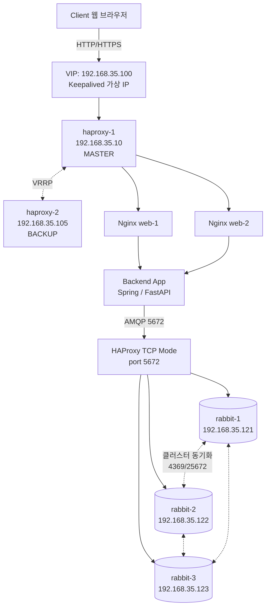

# RabbitMQ 3노드 클러스터 구축 가이드

> HAProxy TCP 로드밸런싱 연동 포함
> KOSA 인프라 미니 프로젝트 · 작성일 2026-04-15

---

## 목차

1. [전체 아키텍처 및 메시지 흐름](#1-전체-아키텍처-및-메시지-흐름)
2. [사전 준비 (3노드 공통)](#2-사전-준비-3노드-공통)
3. [RabbitMQ 설치 (3노드 공통)](#3-rabbitmq-설치-3노드-공통)
4. [Erlang Cookie 통일](#4-erlang-cookie-통일-클러스터링의-핵심)
5. [클러스터 조인](#5-클러스터-조인)
6. [계정 생성 및 운영 정책](#6-계정-생성-및-운영-정책-설정)
7. [HAProxy TCP 로드밸런싱 설정](#7-haproxy-tcp-로드밸런싱-설정)
8. [동작 확인 체크리스트](#8-동작-확인-체크리스트)
9. [트러블슈팅](#9-자주-발생하는-문제-및-해결)
10. [구축 완료 최종 체크리스트](#10-구축-완료-최종-체크리스트)

---

## 1. 전체 아키텍처 및 메시지 흐름

### 1.1 구성도

본 가이드는 3티어 HA 아키텍처 내에서 RabbitMQ를 3노드 클러스터로 구성하고, HAProxy를 통해 로드밸런싱하는 방식을 다룹니다.



<details>
<summary>ASCII 다이어그램 (Mermaid 미지원 환경)</summary>

```
                        ┌───────────────────────────┐
                        │   Client (웹 브라우저)       │
                        └─────────────┬─────────────┘
                                      │ HTTP/HTTPS (80/443)
                                      ▼
                        ┌───────────────────────────┐
                        │    VIP : 192.168.35.100     │   ← Keepalived 가상 IP
                        └─────────────┬─────────────┘
                                      │
                   ┌──────────────────┴──────────────────┐
                   ▼                                     ▼
        ┌──────────────────┐                  ┌──────────────────┐
        │    haproxy-1     │  ◀─ VRRP ─▶      │    haproxy-2     │
        │  192.168.35.10   │                  │  192.168.35.105  │
        │  (MASTER)        │                  │  (BACKUP)        │
        └────────┬─────────┘                  └────────┬─────────┘
                 │                                     │
                 └──────────────┬──────────────────────┘
                                │  (1) HTTP → Nginx
                                ▼
                 ┌──────────────────────────────┐
                 │   Nginx Web Tier              │
                 │   web-1 / web-2               │
                 └──────────────┬───────────────┘
                                │  (2) Backend API 호출
                                ▼
                 ┌──────────────────────────────┐
                 │   Backend Application         │
                 │   (WAS - Spring / FastAPI 등)  │
                 └──────────────┬───────────────┘
                                │  (3) AMQP publish (포트 5672)
                                ▼
                 ┌──────────────────────────────┐
                 │   HAProxy (TCP 모드, 5672)    │  ← 같은 HAProxy에 frontend 추가
                 └──────────────┬───────────────┘
                                │  (4) 3노드 중 하나로 라우팅
                ┌───────────────┼────────────────┐
                ▼               ▼                ▼
        ┌───────────┐   ┌───────────┐   ┌───────────┐
        │ rabbit-1  │   │ rabbit-2  │   │ rabbit-3  │
        │ .35.121   │◀─▶│ .35.122   │◀─▶│ .35.123   │
        │ (Disc)    │   │ (Disc)    │   │ (Disc)    │
        └───────────┘   └───────────┘   └───────────┘
              ▲                 ▲                 ▲
              └─────────────────┴─────────────────┘
                   클러스터 내부 동기화 (포트 25672)
                   + Erlang EPMD (포트 4369)
```

</details>

### 1.2 메시지 처리 플로우 (단계별)

| 단계 | 흐름 | 설명 |
|------|------|------|
| ① | **Client → HAProxy (HTTP)** | 사용자가 VIP(192.168.35.100)로 요청. Keepalived가 MASTER HAProxy로 VIP 할당 |
| ② | **HAProxy → Nginx** | HAProxy가 roundrobin으로 web-1/web-2 중 선택해 요청 전달 |
| ③ | **Nginx → Backend** | Nginx가 정적 콘텐츠 처리 후 동적 요청은 Backend(WAS)로 프록시 |
| ④ | **Backend → HAProxy(TCP 5672)** | Backend 애플리케이션이 pika/amqplib 등으로 RabbitMQ에 publish. 연결 대상은 HAProxy의 5672 포트(VIP) |
| ⑤ | **HAProxy(TCP) → RabbitMQ 노드** | HAProxy가 TCP 모드 roundrobin으로 rabbit-1/2/3 중 살아있는 노드 하나로 TCP 연결 터널링 |
| ⑥ | **클러스터 내부 복제** | Quorum Queue에 저장되면 Raft 프로토콜로 3노드 중 과반수(2/3)에 복제 완료 후 publisher confirm 반환 |
| ⑦ | **Consumer 수신** | Consumer(다른 Backend 또는 Worker)가 HAProxy를 통해 RabbitMQ에 연결, 큐에서 메시지를 consume |

> 💡 **핵심 포인트**
> Backend는 항상 HAProxy VIP(:5672)만 바라보기 때문에 RabbitMQ 노드 IP가 바뀌거나 한 노드가 죽어도 애플리케이션 수정이 불필요합니다.

### 1.3 VM 및 포트 정보

| 호스트명 | IP | 역할 | 주요 포트 |
|----------|----|----|-----------|
| rabbit-1 | 192.168.35.121 | RabbitMQ Node 1 | 5672, 15672, 4369, 25672 |
| rabbit-2 | 192.168.35.122 | RabbitMQ Node 2 | 5672, 15672, 4369, 25672 |
| rabbit-3 | 192.168.35.123 | RabbitMQ Node 3 | 5672, 15672, 4369, 25672 |
| haproxy-1/2 | 192.168.35.10 / 105 (VIP .100) | 로드밸런서 | 80, 443, 5672, 15672 |

| 포트 | 용도 | 비고 |
|------|------|------|
| 5672 | AMQP (클라이언트 연결) | Backend ↔ RabbitMQ |
| 15672 | 관리 UI / HTTP API | 브라우저 접속용 |
| 4369 | Erlang Port Mapper (EPMD) | 노드 디스커버리 |
| 25672 | 노드 간 클러스터 통신 | Erlang 분산 |
| 35672–35682 | CLI 도구 통신 | `rabbitmqctl` 등 |

---

## 2. 사전 준비 (3노드 공통)

아래 작업은 `rabbit-1`, `rabbit-2`, `rabbit-3` 세 대 모두에서 동일하게 실행합니다.

### 2.1 hostname 설정

각 VM에서 자기 이름으로 설정합니다.

```bash
# rabbit-1 VM에서
sudo hostnamectl set-hostname rabbit-1

# rabbit-2 VM에서
sudo hostnamectl set-hostname rabbit-2

# rabbit-3 VM에서
sudo hostnamectl set-hostname rabbit-3

# 접속 세션 갱신 (or 재로그인)
exec bash
```

### 2.2 /etc/hosts 등록 (3대 모두 동일)

RabbitMQ는 호스트명 기반으로 클러스터 통신을 하므로 반드시 필요합니다.

```bash
sudo vi /etc/hosts
```

```
192.168.35.121  rabbit-1
192.168.35.122  rabbit-2
192.168.35.123  rabbit-3
```

```bash
# 확인
ping -c 2 rabbit-1
ping -c 2 rabbit-2
ping -c 2 rabbit-3
```

### 2.3 NTP 시간 동기화 (필수)

클러스터 노드 간 시간이 어긋나면 인증/복제 에러가 발생합니다.

```bash
sudo apt update
sudo apt install -y chrony
sudo systemctl enable --now chrony

# 동기화 상태 확인 (System clock synchronized: yes 여야 함)
timedatectl
chronyc sources
```

### 2.4 방화벽 포트 개방

```bash
sudo ufw allow 5672/tcp         # AMQP
sudo ufw allow 15672/tcp        # 관리 UI
sudo ufw allow 4369/tcp         # EPMD (Erlang Port Mapper)
sudo ufw allow 25672/tcp        # 노드 간 클러스터 통신
sudo ufw allow 35672:35682/tcp  # CLI 도구용

# UFW가 비활성화 상태라면 활성화
sudo ufw enable
sudo ufw status
```

> ⚠️ **주의**
> `4369`, `25672` 포트는 노드 간 통신에 반드시 필요합니다. 막혀 있으면 클러스터 조인이 실패합니다.

---

## 3. RabbitMQ 설치 (3노드 공통)

### 3.1 저장소 키 추가

```bash
sudo apt update
sudo apt install -y curl gnupg apt-transport-https

# RabbitMQ 팀 서명 키
curl -1sLf "https://keys.openpgp.org/vks/v1/by-fingerprint/0A9AF2115F4687BD29803BA42EF3BEB4480BB501" \
  | sudo gpg --dearmor -o /usr/share/keyrings/com.rabbitmq.team.gpg

# Erlang 저장소 키
curl -1sLf "https://github.com/rabbitmq/signing-keys/releases/download/3.0/cloudsmith.rabbitmq-erlang.E495BB49CC4BBE5B.key" \
  | sudo gpg --dearmor -o /usr/share/keyrings/rabbitmq.E495BB49CC4BBE5B.gpg

# RabbitMQ 서버 저장소 키
curl -1sLf "https://github.com/rabbitmq/signing-keys/releases/download/3.0/cloudsmith.rabbitmq-server.9F4587F226208342.key" \
  | sudo gpg --dearmor -o /usr/share/keyrings/rabbitmq.9F4587F226208342.gpg
```

### 3.2 저장소 등록

```bash
sudo tee /etc/apt/sources.list.d/rabbitmq.list <<'EOF'
## Cloudsmith Erlang 저장소 (Ubuntu 24.04 noble)
deb [signed-by=/usr/share/keyrings/rabbitmq.E495BB49CC4BBE5B.gpg] https://ppa1.rabbitmq.com/rabbitmq/rabbitmq-erlang/deb/ubuntu noble main
deb-src [signed-by=/usr/share/keyrings/rabbitmq.E495BB49CC4BBE5B.gpg] https://ppa1.rabbitmq.com/rabbitmq/rabbitmq-erlang/deb/ubuntu noble main

## Cloudsmith RabbitMQ 저장소
deb [signed-by=/usr/share/keyrings/rabbitmq.9F4587F226208342.gpg] https://ppa1.rabbitmq.com/rabbitmq/rabbitmq-server/deb/ubuntu noble main
deb-src [signed-by=/usr/share/keyrings/rabbitmq.9F4587F226208342.gpg] https://ppa1.rabbitmq.com/rabbitmq/rabbitmq-server/deb/ubuntu noble main
EOF

sudo apt update
```

### 3.3 Erlang + RabbitMQ 설치

```bash
sudo apt install -y erlang-base \
  erlang-asn1 erlang-crypto erlang-eldap erlang-ftp erlang-inets \
  erlang-mnesia erlang-os-mon erlang-parsetools erlang-public-key \
  erlang-runtime-tools erlang-snmp erlang-ssl erlang-syntax-tools \
  erlang-tftp erlang-tools erlang-xmerl

sudo apt install -y rabbitmq-server --fix-missing

# 버전 확인
sudo rabbitmqctl version
```

### 3.4 서비스 자동 시작 등록

```bash
sudo systemctl enable rabbitmq-server
sudo systemctl start rabbitmq-server
sudo systemctl status rabbitmq-server
```

### 3.5 관리 UI 플러그인 활성화

```bash
sudo rabbitmq-plugins enable rabbitmq_management

# 플러그인 목록 확인
sudo rabbitmq-plugins list
```

---

## 4. Erlang Cookie 통일 (클러스터링의 핵심)

RabbitMQ 노드 간 인증은 **Erlang Cookie**라는 공유 비밀 값으로 이루어집니다. 3노드 모두 동일한 cookie를 가져야만 클러스터가 구성됩니다.

### 4.1 rabbit-1의 cookie 값 확인

```bash
# rabbit-1 에서만 실행
sudo cat /var/lib/rabbitmq/.erlang.cookie

# 출력 예시: ABCDEFGHIJKLMNOPQRST
# 이 값을 메모장 등에 복사
```

### 4.2 rabbit-2, rabbit-3에 cookie 덮어쓰기

```bash
# rabbit-2, rabbit-3 양쪽에서 각각 실행
sudo systemctl stop rabbitmq-server

# rabbit-1에서 복사한 값을 아래 "COOKIE값" 부분에 붙여넣기
sudo sh -c 'echo -n "COOKIE값" > /var/lib/rabbitmq/.erlang.cookie'

# 퍼미션 복구 (중요)
sudo chown rabbitmq:rabbitmq /var/lib/rabbitmq/.erlang.cookie
sudo chmod 400 /var/lib/rabbitmq/.erlang.cookie

# 서비스 재시작
sudo systemctl start rabbitmq-server
```

### 4.3 3노드 cookie 일치 확인

```bash
# 3노드 각각에서 실행 → 세 값이 완전히 동일해야 함
sudo cat /var/lib/rabbitmq/.erlang.cookie; echo
```

> ⚠️ **주의**
> Cookie 값이 다르면 `Authentication failed` 또는 `nodedown` 에러가 발생하며 클러스터 조인이 실패합니다. **90% 이상의 조인 실패는 cookie 문제**입니다.

---

## 5. 클러스터 조인

`rabbit-1`은 기준 노드로 그대로 두고, `rabbit-2`와 `rabbit-3`을 `rabbit-1`에 조인시킵니다.

### 5.1 rabbit-2에서 실행

```bash
# 앱 정지 → 데이터 초기화 → 클러스터 조인 → 앱 시작
sudo rabbitmqctl stop_app
sudo rabbitmqctl reset
sudo rabbitmqctl join_cluster rabbit@rabbit-1
sudo rabbitmqctl start_app

# 조인 확인
sudo rabbitmqctl cluster_status
```

### 5.2 rabbit-3에서 실행

```bash
sudo rabbitmqctl stop_app
sudo rabbitmqctl reset
sudo rabbitmqctl join_cluster rabbit@rabbit-1
sudo rabbitmqctl start_app

sudo rabbitmqctl cluster_status
```

### 5.3 최종 클러스터 상태 확인

아무 노드에서나 아래 명령을 실행합니다. `Running Nodes` 목록에 3개 노드가 모두 보여야 합니다.

```bash
sudo rabbitmqctl cluster_status
```

**정상 출력 예시**

```
Cluster status of node rabbit@rabbit-1 ...
Basics
  Cluster name: rabbit@rabbit-1
Disk Nodes
  rabbit@rabbit-1
  rabbit@rabbit-2
  rabbit@rabbit-3
Running Nodes
  rabbit@rabbit-1
  rabbit@rabbit-2
  rabbit@rabbit-3
```

---

## 6. 계정 생성 및 운영 정책 설정

아래 설정은 클러스터 내에서 자동으로 전파되므로 **rabbit-1 한 곳에서만** 실행하면 됩니다.

### 6.1 관리자 계정 생성

```bash
# admin 계정 생성 (비밀번호는 본인 것으로)
sudo rabbitmqctl add_user admin 'StrongPassword!23'
sudo rabbitmqctl set_user_tags admin administrator
sudo rabbitmqctl set_permissions -p / admin ".*" ".*" ".*"

# 기본 guest 계정 삭제 (보안)
sudo rabbitmqctl delete_user guest

# 계정 목록 확인
sudo rabbitmqctl list_users
```

### 6.2 Quorum Queue를 기본 큐 타입으로 설정

Classic Mirrored Queue는 RabbitMQ 3.13부터 deprecated 되었으며, 4.x부터는 제거됩니다. **Quorum Queue(Raft 기반)가 표준**입니다.

```bash
# vhost '/'의 기본 큐 타입을 quorum으로 설정
sudo rabbitmqctl set_vhost_limits -p / '{"default-queue-type":"quorum"}'

# 확인
sudo rabbitmqctl list_vhost_limits
```

> 💡 **참고**
> `set_policy`로 기존 classic queue를 quorum으로 **"변환"할 수는 없습니다.** 큐 타입은 선언 시점에만 결정됩니다. 애플리케이션 코드에서 명시적으로 지정하는 방식을 권장합니다.

#### 애플리케이션 코드 예시 (Python pika)

```python
import pika

# HAProxy VIP로 연결
params = pika.ConnectionParameters(
    host='192.168.35.100',   # HAProxy VIP
    port=5672,
    credentials=pika.PlainCredentials('admin', 'StrongPassword!23'),
    heartbeat=60,
    blocked_connection_timeout=300,
)
connection = pika.BlockingConnection(params)
channel = connection.channel()

# Quorum Queue 선언
channel.queue_declare(
    queue='task_queue',
    durable=True,
    arguments={'x-queue-type': 'quorum'}
)

# Publisher Confirm 활성화 (메시지 유실 방지)
channel.confirm_delivery()

channel.basic_publish(
    exchange='',
    routing_key='task_queue',
    body='Hello Quorum!',
    properties=pika.BasicProperties(delivery_mode=2)  # persistent
)
```

### 6.3 클러스터 파티션 핸들링 정책

네트워크 분리(split-brain) 상황에서 노드들이 어떻게 행동할지 설정합니다. Quorum Queue를 쓰는 경우 `pause_minority`가 가장 안전합니다.

```bash
# 3노드 모두에서 설정
sudo tee -a /etc/rabbitmq/rabbitmq.conf <<'EOF'

## 클러스터 파티션 핸들링 (split-brain 방지)
cluster_partition_handling = pause_minority

## 디스크 여유 최소 임계값 (기본 50MB는 너무 작음)
disk_free_limit.absolute = 2GB

## 메모리 임계값 (기본 0.4 = 40%, 그대로 두어도 무방)
vm_memory_high_watermark.relative = 0.4
EOF

# 설정 반영 (3노드 모두)
sudo systemctl restart rabbitmq-server
```

---

## 7. HAProxy TCP 로드밸런싱 설정

HAProxy가 RabbitMQ의 AMQP(5672)와 관리 UI(15672)를 로드밸런싱하도록 frontend/backend를 추가합니다.

### 7.1 `/etc/haproxy/haproxy.cfg` 추가 내용

`haproxy-1`, `haproxy-2` 양쪽에 **동일하게** 반영합니다.

```haproxy
#----------------------------------------------------------
# RabbitMQ AMQP (TCP 5672)
#----------------------------------------------------------
frontend rabbitmq_amqp_front
    bind *:5672
    mode tcp
    option tcplog
    timeout client 3h
    default_backend rabbitmq_amqp_back

backend rabbitmq_amqp_back
    mode tcp
    balance roundrobin
    timeout server 3h
    timeout connect 5s
    option tcp-check
    tcp-check connect port 5672
    server rabbit-1 192.168.35.121:5672 check inter 5s rise 2 fall 3
    server rabbit-2 192.168.35.122:5672 check inter 5s rise 2 fall 3
    server rabbit-3 192.168.35.123:5672 check inter 5s rise 2 fall 3

#----------------------------------------------------------
# RabbitMQ Management UI (HTTP 15672)
#----------------------------------------------------------
frontend rabbitmq_mgmt_front
    bind *:15672
    mode http
    option httplog
    default_backend rabbitmq_mgmt_back

backend rabbitmq_mgmt_back
    mode http
    balance roundrobin
    option httpchk GET /api/aliveness-test/%2F
    http-check expect status 200
    server rabbit-1 192.168.35.121:15672 check inter 5s rise 2 fall 3
    server rabbit-2 192.168.35.122:15672 check inter 5s rise 2 fall 3
    server rabbit-3 192.168.35.123:15672 check inter 5s rise 2 fall 3
```

> ⚠️ **주의**
> `timeout 3h`가 중요합니다. AMQP는 장기 연결(long-lived connection)을 사용하므로 HAProxy 기본값(1분)을 쓰면 커넥션이 주기적으로 끊어집니다.

### 7.2 방화벽 (HAProxy 서버)

```bash
sudo ufw allow 5672/tcp
sudo ufw allow 15672/tcp
```

### 7.3 HAProxy 설정 검증 및 재시작

```bash
# 설정 문법 검증
sudo haproxy -c -f /etc/haproxy/haproxy.cfg

# 무중단 재로드 (기존 연결 유지)
sudo systemctl reload haproxy

# 또는 전체 재시작
sudo systemctl restart haproxy

# 백엔드 상태 확인
echo "show servers state" | sudo socat stdio /run/haproxy/admin.sock
```

---

## 8. 동작 확인 체크리스트

### 8.1 관리 UI 접속

브라우저에서 VIP 또는 각 노드 IP로 접속:

- http://192.168.35.100:15672 — HAProxy VIP 경유
- http://192.168.35.121:15672 — rabbit-1 직접
- http://192.168.35.122:15672 — rabbit-2 직접
- http://192.168.35.123:15672 — rabbit-3 직접

로그인: `admin` / `StrongPassword!23`
**Overview → Nodes 탭**에서 3개 노드 모두 초록색인지 확인

### 8.2 CLI 체크 명령

```bash
# 클러스터 상태
sudo rabbitmqctl cluster_status

# 큐 목록
sudo rabbitmqctl list_queues name type messages

# 연결된 클라이언트
sudo rabbitmqctl list_connections

# 노드 헬스 체크
sudo rabbitmq-diagnostics -q check_running
sudo rabbitmq-diagnostics -q check_local_alarms
sudo rabbitmq-diagnostics -q check_port_connectivity
```

### 8.3 HAProxy 경유 연결 테스트

```bash
# telnet으로 5672 포트 확인
telnet 192.168.35.100 5672
# ▶ 연결되면 Ctrl+] → quit로 빠져나옴

# Python 간단 테스트
python3 <<'EOF'
import pika
params = pika.ConnectionParameters(
    host='192.168.35.100', port=5672,
    credentials=pika.PlainCredentials('admin', 'StrongPassword!23')
)
conn = pika.BlockingConnection(params)
print('Connected:', conn.is_open)
conn.close()
EOF
```

### 8.4 장애 시나리오 테스트

| 시나리오 | 실행 방법 | 기대 결과 |
|----------|-----------|-----------|
| 노드 1대 정지 | `rabbit-1`에서 `sudo systemctl stop rabbitmq-server` | 나머지 2노드 정상 동작, HAProxy가 rabbit-1 제외, 메시지 publish/consume 지속 |
| 노드 복구 | `rabbit-1`에서 `sudo systemctl start rabbitmq-server` | 자동으로 클러스터 재조인, HAProxy에 다시 등록 |
| HAProxy MASTER 정지 | `haproxy-1`에서 `sudo systemctl stop keepalived` | VIP가 `haproxy-2`로 페일오버, RabbitMQ 연결 유지 |
| 2노드 동시 장애 | `rabbit-2`, `rabbit-3` 동시 정지 | `pause_minority` 설정으로 `rabbit-1`도 일시 정지 (split-brain 방지) |

---

## 9. 자주 발생하는 문제 및 해결

### ❗ 조인 시 "unable to connect to node"

**원인**

1. Erlang cookie 불일치
2. `/etc/hosts` 미등록
3. `4369/25672` 방화벽

**해결**

```bash
# 1) 3노드 cookie 값 비교
sudo cat /var/lib/rabbitmq/.erlang.cookie

# 2) 이름 해석 확인
ping rabbit-1 && ping rabbit-2 && ping rabbit-3

# 3) 포트 리스닝 확인
sudo ss -tlnp | grep -E "4369|25672"
```

### ❗ "Authentication failed" 에러

**원인:** Erlang cookie 파일 권한 문제 또는 값 불일치

**해결**

```bash
sudo chown rabbitmq:rabbitmq /var/lib/rabbitmq/.erlang.cookie
sudo chmod 400 /var/lib/rabbitmq/.erlang.cookie
sudo systemctl restart rabbitmq-server
```

### ❗ HAProxy에서 헬스체크 실패

**원인:** RabbitMQ는 정상인데 tcp-check만 간헐적 실패

**해결:** `rise`/`fall` 값 완화 — `rise 2 fall 5`, `inter 10s`로 조정

### ❗ 관리 UI 접속 안 됨

**원인:** management 플러그인 비활성화

**해결**

```bash
sudo rabbitmq-plugins enable rabbitmq_management
sudo systemctl restart rabbitmq-server
```

### ❗ 메시지가 간헐적으로 유실됨

**원인:** Publisher Confirm 미사용 또는 non-persistent 메시지

**해결:** `channel.confirm_delivery()` + `delivery_mode=2` + Quorum Queue 조합 사용

### ❗ 커넥션이 주기적으로 끊김

**원인:** HAProxy timeout 기본값(1분)

**해결:** `backend`에 `timeout server 3h` 설정 (7장 참고)

### 9.1 로그 확인 위치

```bash
# 메인 로그
sudo tail -f /var/log/rabbitmq/rabbit@rabbit-1.log

# 에러만 추출
sudo grep -i error /var/log/rabbitmq/rabbit@*.log

# systemd journal
sudo journalctl -u rabbitmq-server -f

# HAProxy 로그
sudo tail -f /var/log/haproxy.log
```

---

## 10. 구축 완료 최종 체크리스트

- [ ] 3노드 모두 hostname 설정 및 `/etc/hosts` 등록 완료
- [ ] 3노드 NTP(chrony) 동기화 확인 (`timedatectl`)
- [ ] 3노드 방화벽 포트(5672/15672/4369/25672) 개방
- [ ] RabbitMQ + management 플러그인 설치 완료
- [ ] `systemctl enable rabbitmq-server` 자동 시작 등록
- [ ] 3노드 Erlang cookie 값 완전 일치 (diff 확인)
- [ ] `rabbit-2`, `rabbit-3` 클러스터 조인 성공
- [ ] `rabbitmqctl cluster_status`에 3노드 모두 Running
- [ ] admin 계정 생성, guest 계정 삭제
- [ ] `default-queue-type`을 `quorum`으로 설정
- [ ] `cluster_partition_handling = pause_minority` 적용
- [ ] `disk_free_limit.absolute = 2GB` 적용
- [ ] HAProxy `rabbitmq_amqp_front/back` (5672 TCP) 추가
- [ ] HAProxy `rabbitmq_mgmt_front/back` (15672 HTTP) 추가
- [ ] HAProxy `timeout 3h` 설정
- [ ] `haproxy -c -f` 설정 검증 통과
- [ ] VIP(`192.168.35.100:5672`)로 연결 테스트 성공
- [ ] 관리 UI에서 3노드 모두 초록색 확인
- [ ] 노드 1대 정지 시 서비스 지속 확인
- [ ] Publisher Confirm + Quorum Queue로 메시지 유실 없음 확인
